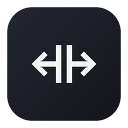

# Screen Resize (Swift Clone)

A modern, fast, and lightweight clone of the classic **Spectacle** window manager for macOS, rewritten completely in Swift.



## Highlights

- **Pure Swift**: Written from the ground up in modern Swift and SwiftUI.
- **Modern macOS Support**: Fully compatible with macOS 13.0 (Ventura), macOS 14.0 (Sonoma), macOS 15.0 (Sequoia), and future versions.
- **Lightweight Menu Bar App**: Runs quietly in the menu bar (`LSUIElement`) with zero unnecessary overhead.
- **Customizable Global Hotkeys**: Uses [KeyboardShortcuts](https://github.com/sindresorhus/KeyboardShortcuts) for recording and managing shortcuts.
- **Multi-Monitor Support**: Effortlessly move and scale windows across multiple displays.
- **Launch at Login**: Native toggle supported via modern macOS `SMAppService`.

---

## Default Shortcuts

| Action | Shortcut |
| :--- | :--- |
| **Left Half** | `⌥ ⌘ ←` |
| **Right Half** | `⌥ ⌘ →` |
| **Top Half** | `⌥ ⌘ ↑` |
| **Bottom Half** | `⌥ ⌘ ↓` |
| **Upper Left** | `⌃ ⌘ ←` |
| **Lower Left** | `⌃ ⇧ ⌘ ←` |
| **Upper Right** | `⌃ ⌘ →` |
| **Lower Right** | `⌃ ⇧ ⌘ →` |
| **Center** | `⌥ ⌘ C` |
| **Maximize** | `⌥ ⌘ F` |
| **Almost Maximize** | `⌥ ⇧ ⌘ F` |
| **Make Larger** | `⌃ ⌥ =` |
| **Make Smaller** | `⌃ ⌥ -` |
| **Next Third** | `⌃ ⌥ →` |
| **Previous Third** | `⌃ ⌥ ←` |
| **Center Third** | `⌃ ⌥ C` |
| **Next Display** | `⌃ ⌥ ⌘ →` |
| **Previous Display** | `⌃ ⌥ ⌘ ←` |
| **Undo** | `⌥ ⌘ Z` |

---

## Getting Started

### Prerequisites

- macOS 13.0 or higher
- Xcode 15 or higher
- [XcodeGen](https://github.com/yonaskolb/XcodeGen) (`brew install xcodegen`)

### Local Code Signing (one time)

The app moves other apps' windows, so it needs Accessibility permission. macOS ties that permission to the app's code signature. With ad-hoc signing ("Sign to Run Locally") the signature changes on every build, so macOS silently drops the permission and window actions stop working.

To avoid that, the project is signed with a local self-signed certificate named **`ScreenResize Local`** (see `CODE_SIGN_IDENTITY` in `project.yml`). The build fails until this certificate exists in your keychain.

1. Open Certificate Assistant:
   ```bash
   open "/System/Library/CoreServices/Certificate Assistant.app"
   ```
   > On macOS 26+, searching for "Keychain Access" may open the Passwords app instead. Opening Certificate Assistant directly avoids that. On older macOS you can also use **Keychain Access → Certificate Assistant → Create a Certificate…** from the top menu bar.

2. Choose **Create a Certificate…** and fill in:
   - **Name:** `ScreenResize Local` (must match exactly)
   - **Identity Type:** Self Signed Root
   - **Certificate Type:** Code Signing

   Click **Create**, then **Continue** on the warning, then **Done**.

3. Check that it's available:
   ```bash
   security find-identity -p codesigning
   ```
   You should see `"ScreenResize Local"`. A `CSSMERR_TP_NOT_TRUSTED` note is expected for a self-signed certificate and is fine.

### Building and Installing

1. Generate the Xcode project and build:
   ```bash
   xcodegen generate
   xcodebuild -scheme ScreenResize -configuration Release -derivedDataPath DerivedData build
   ```
   The first time, macOS may ask to let `codesign` use the `ScreenResize Local` key. Enter your password and click **Always Allow**.

   Check the signature (it must not say `adhoc`):
   ```bash
   codesign -dv --verbose=2 DerivedData/Build/Products/Release/ScreenResize.app 2>&1 | grep Authority
   # Authority=ScreenResize Local
   ```

2. Install it to `/Applications` (always run this copy, not the one in `DerivedData`):
   ```bash
   killall ScreenResize
   rm -rf /Applications/ScreenResize.app
   cp -R DerivedData/Build/Products/Release/ScreenResize.app /Applications/
   ```

3. **Grant Accessibility permission** (first install only):
   ```bash
   tccutil reset Accessibility dev.tymoshenko.screenresize
   open /Applications/ScreenResize.app
   ```
   Click **Open System Settings** in the prompt and enable **Screen Resize** under **System Settings → Privacy & Security → Accessibility**. Remove any old duplicate "ScreenResize" entries with **–**. Then relaunch once:
   ```bash
   killall ScreenResize; open /Applications/ScreenResize.app
   ```

### Rebuilding

Repeat steps 1 and 2 of **Building and Installing**, then `open /Applications/ScreenResize.app`. The permission stays because the signature stays the same (same certificate and bundle ID). There's no need to reset or grant it again.

### Lost or Replaced Certificate

If the `ScreenResize Local` certificate is deleted, or you set up a new Mac, the build fails to sign (or the permission stops matching). Create the certificate again with the same name (see **Local Code Signing**), rebuild and reinstall, then do step 3 of **Building and Installing** again. A new certificate is a new identity, so macOS needs the permission granted once more.

---

## License

MIT License.
